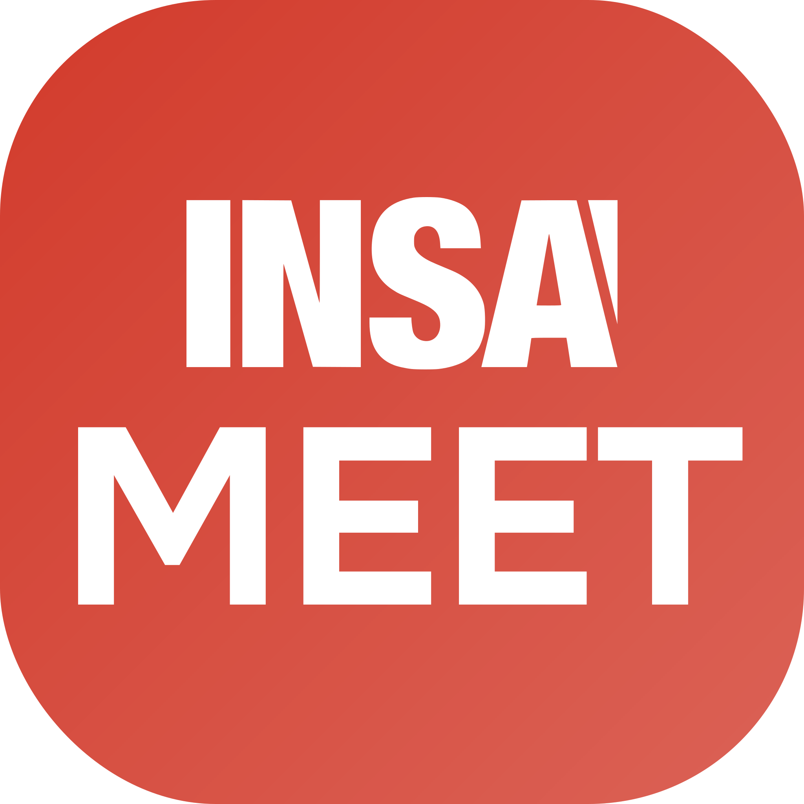
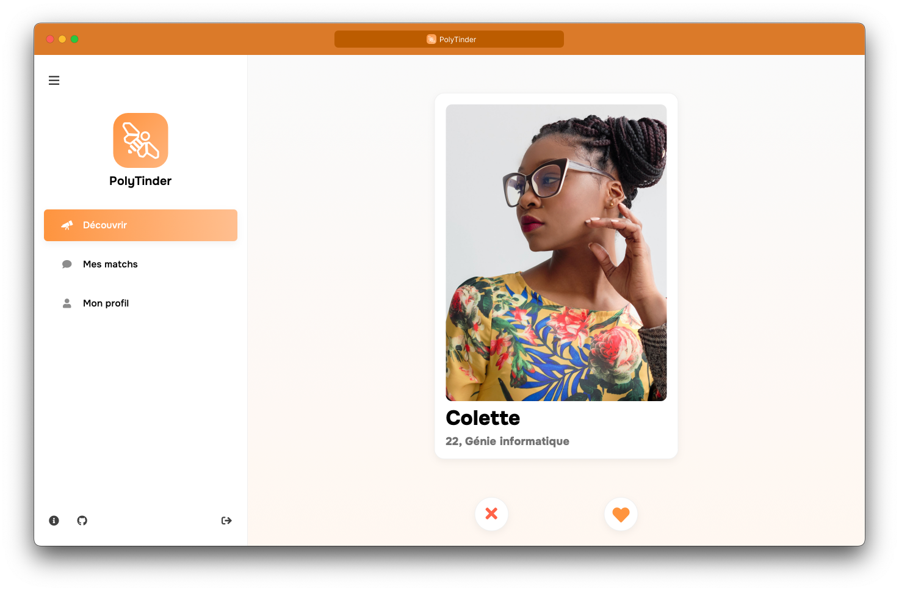

<p align="center">
    
</p>

<h1 style="border: none;" align="center">PolyTinder</h1>

<hr>

<p style="font-size: 24px;" align="center">Faites des rencontres de génies</p>

<p style="font-size: 18px" align="center">Visit the app now at <a href="https://polytinder.com">polytinder.com</a> !</p>

<p align="center">
    <a href="#-about">About</a>
    <span>•</span>
    <a href="#-how-to-contribute">How to contribute</a>
    <span>•</span>
    <a href="#%EF%B8%8F-project-structure">Project structure</a>
    <span>•</span>
    <a href="#-installation">Installation</a>
    <span>•</span>
    <a href="#-more-documentation">More documentation</a>
</p>



## 📋 About

Based on the original idea from [PolyGossip](https://www.instagram.com/poly_gossip/), the PolyTinder app aims to bring Polytechnique students closer together and create new relationships.

The app is developed by Polytechnique students, for Polytechnique students.

## 💪 How to contribute

The PolyTinder project is never finished! We are always looking for new features to add, bugs to fix and new ideas to implement.

You don't need to be a programmer to contribute. If you have ideas or find a bug, report it in the [Issues]() section of the project. If you are a programmer, you can contribute by making a [Pull Request]().

## 🏗️ Project structure

### Packages

The project is divided into several packages, each having a well defined role.

- **[API](./packages/api)**: Public API of the application
- **[API Admin](./packages/api)**: Private API for the admin (same package as API)
- **[Client](./packages/client)**: Web client for the app
- **[Admin](./packages/admin)**: Web client for the admin
- **[Common](./packages/common)**: Common code shared between packages

A detailed description of each package is available in the README of each.

## 🛠 Installation

### Prerequisites

- **[Docker](https://www.docker.com/)**: to run the development stack.
- **[VSCode](https://code.visualstudio.com/)**: to develop.
- **Extension [Dev Containers](https://marketplace.visualstudio.com/items?itemName=ms-vscode-remote.remote-containers)**: to create the development environment.

### Local development

In order to ensure that the correct development environment is used regardless of the machine, we use Docker for development. This way, dependencies (Angular CLI, for example) are installed in the container and not on the local machine. (For more information, see [Dev Containers](https://code.visualstudio.com/docs/remote/containers))

Then, the application stack is launched with Docker Compose to launch all the necessary services.

### Installation

1. Clone the project

    ```bash
    git clone git@github.com:PolyTinder/poly-tinder.git
    ```

2. Open the project in VSCode

    ```bash
    cd poly-tinder
    code .
    ```

3. Click on the `Reopen in Container` button in the lower left corner of the interface. (This step may take some time the first time)

4. Install packages dependencies, from each packages, run:

    ```bash
    npm ci
    ```

4. Populate the database, from the API package, run:

    ```bash
    npx knex seed:run test-users
    ```

5. Launch the stack

    ```bash
    make
    ```

6. Open the app in your browser at [http://localhost:4200](http://localhost:4200). You can login with any user from the [seeds](./packages/api/seeds/test-users.js) file (but leaving the password blank).

## 📄 More documentation

- [Deploy](./docs/deploys.md)
