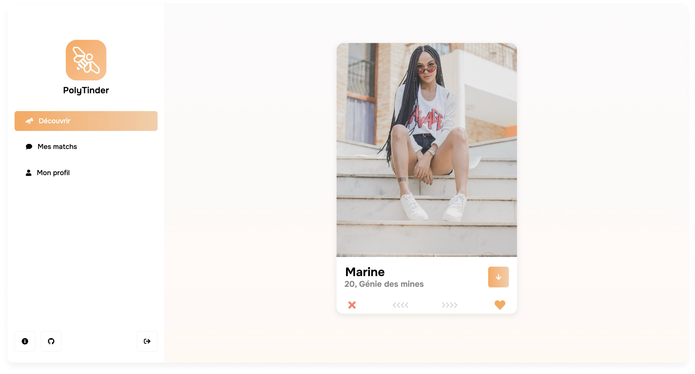

<p align="center">
    
</p>

<h1 style="border: none;" align="center">PolyTinder</h1>

<p align="center">
    
    
    
</p>
<p align="center">
    
    
    
    
</p>

<hr>

#### ⚠️ PolyTinder is closed ⚠️

PolyTinder has received an exceptional reception within the student community, with the registration of several hundred members. However, due to the high costs associated with keeping the platform online, I made the decision to close the site.

This does not mean the end of PolyTinder! I currently do not have the time to create a committee to get the help and funding necessary to continue the project. However, if you are interested in taking over PolyTinder to maintain or transform it, do not hesitate to contact me at poly.tinder.2023@gmail.com. I would be delighted to help you take over the project.

Thank you to everyone who participated in PolyTinder, and see you soon!

<hr>

<p style="font-size: 24px;" align="center">Faites des rencontres de génies</p>

<p style="font-size: 18px" align="center">Visit the app now at <a href="https://polytinder.com">polytinder.com</a> !</p>

<p align="center">
    <a href="#-about">About</a>
    <span>•</span>
    <a href="#-how-to-contribute">How to contribute</a>
    <span>•</span>
    <a href="#%EF%B8%8F-project-structure">Project structure</a>
    <span>•</span>
    <a href="#-installation">Installation</a>
    <span>•</span>
    <a href="#-more-documentation">More documentation</a>
</p>



## 📋 About

Based on the original idea from [PolyGossip](https://www.instagram.com/poly_gossip/), the PolyTinder app aims to bring Polytechnique students closer together and create new relationships.

The app is developed by Polytechnique students, for Polytechnique students.

## 💪 How to contribute

The PolyTinder project is never finished! We are always looking for new features to add, bugs to fix and new ideas to implement.

You don't need to be a programmer to contribute. If you have ideas or find a bug, report it in the [Issues]() section of the project.

If you are a programmer, you can contribute by create new fix or features issues. You can also look at existing issues and try to fix them. Here is the process to follow:

1. Report the issue in the [Issues]() section of the project.
    1. If the issue does not alreay exist, create it. Describe the feature you want to add or the bug you want to fix. If you have a solution, describe it. Label the issue with the appropriate label.
    2. Assign yourself to the issue you created or found. This way, we can avoid having two people working on the same thing. If someone is already assigned to the issue, you can comment on it to show your interest in working on it.
2. Click on `Create a branch`, in the `Development` section of the issue. This will create a new branch with the name of the issue.
3. Install the project locally (see [Installation](#-installation)).
4. Checkout the new branch and start working on the issue.
5. Open a pull request when you are done. Describe the changes you made and link the issue. If the pull request takes a long time to complete, you can open it before you are done to get feedback on your work.
6. Make sure the pull request passes all the checks (CI, lint, etc.) and that the code is well formatted.
7. Assign a reviewer to the pull request. This person will review your code and give you feedback. If you are not sure who to assign, assign the person who created the issue or assign the `PolyTinder` account.

## 🏗️ Project structure

### Packages

The project is divided into several packages, each having a well defined role.

- **[API](./packages/api)**: Public API of the application
- **[API Admin](./packages/api)**: Private API for the admin (same package as API)
- **[Client](./packages/client)**: Web client for the app
- **[Admin](./packages/admin)**: Web client for the admin
- **[Common](./packages/common)**: Common code shared between packages

A detailed description of each package is available in the README of each.

## 🛠 Installation

### Prerequisites

- **[Docker](https://www.docker.com/)**: to run the development stack.
- **[VSCode](https://code.visualstudio.com/)**: to develop.
- **Extension [Dev Containers](https://marketplace.visualstudio.com/items?itemName=ms-vscode-remote.remote-containers)**: to create the development environment.

### Local development

In order to ensure that the correct development environment is used regardless of the machine, we use Docker for development. This way, dependencies (Angular CLI, for example) are installed in the container and not on the local machine. (For more information, see [Dev Containers](https://code.visualstudio.com/docs/remote/containers))

Then, the application stack is launched with Docker Compose to launch all the necessary services.

### Installation

1. Clone the project

    ```bash
    git clone git@github.com:PolyTinder/poly-tinder.git
    ```

2. Open the project in VSCode

    ```bash
    cd poly-tinder
    code .
    ```

3. Click on the `Reopen in Container` button in the lower left corner of the interface. (This step may take some time the first time)

4. Install packages dependencies, from each packages, run:

    ```bash
    npm ci
    ```

5. Execute the initial dabaase migration, from the API package, run:

    ```bash
    npx knex migrate:latest
    ```

6. Populate the database, from the API package, run:

    ```bash
    npx knex seed:run test-users
    ```

7. Launch the stack

    ```bash
    make
    ```

    This command will launch the following services:
    - **[API](./packages/api)** (http://localhost:3000): Public API of the application
    - **[API Admin](./packages/api)** (http://localhost:3001): Private API for the admin (same package as API)
    - **[Client](./packages/client)** (http://localhost:4200): Web client for the app
    - **[Admin](./packages/admin)** (http://localhost:4201): Web client for the admin
    - **[Storybook](./packages/client)** (http://localhost:6006): Storybook for the client

8. Open the app in your browser at [http://localhost:4200](http://localhost:4200). You can login with any user from the [seeds](./packages/api/seeds/test-users.js) file (but leaving the password blank).

### Tips and tricks

- **Install the `Docker` extension in VSCode**: Since the start command creates multiple containers, the console will output all the logs from all the containers. This can be confusing. The `Docker` extension allows you to see the logs of each container separately.

## 📄 More documentation

- [Deploy](./docs/deploys.md)
